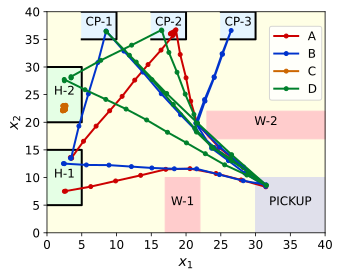

# Task Allocation for Stochastic Multi-Agent Systems (TASMAS) with SymAware framework

**Author:** Zengjie Zhang (z.zhang3@tue.nl)

This project demonstrates the risk-aware allocation of real-time STL specifications for stochastic multi-agent systems, with restricted risk probabilities. 

## Introduction

### Associated Research Work

This library is associated with the Arxiv article in [https://arxiv.org/abs/2404.02111](https://arxiv.org/abs/2404.02111).

### Relation with Existing Toolbox

The `probstlpy` library in this project is modified from the [stlpy](https://github.com/vincekurtz/stlpy/blob/main/README.md) toolbox. 

### Scenario

This library considers a multi-bus routing scenario in a tourism attraction point to validate the effectiveness of the proposed method. The scenario contains four bus terminals denoted as **T-X**, where **X**$\in \{A, B, C, D\}$, four tourist gathering points denoted as **GP-Z**, where **Z**$\in \{I, II, III, IV\}$, and a single unloading point denoted as **ULP** (see the following Figure). Four buses, $A$ to $D$, are tasked with picking up tourists from the gathering points and transporting them to the unloading point. These buses initiate operations from their respective terminals and are expected to return when required. All buses are confined within the attraction point symbolized as ‘**BOX**’. The buses must avoid running into two buildings denoted as **B-Y**, with **Y**$\in \{1, 2\}$. When the tourists at a gathering point reach a certain number, a bus should be available to transport them to the unloading point within a tolerable time limit. Therefore, this study needs to handle dynamically allocated routing tasks, implying that new routing tasks may be assigned at any time $k \in \{0, 1,· · · , N − 1\}$.

[](CASE)


## Installation

### System Requirements

**Operating system**
 - *Windows* (compatible in general, succeed on 11)

**Python Environment**
 - Python version: test passed on `python=3.11`
 - Required Packages: 
   - `gurobipy==11.0.2` (**license** required, see [How to Get a Gurobi License](https://www.gurobi.com/solutions/licensing/))
   - `matplotlib==3.9.0`
   - `numpy==1.26.4`
   - `pybullet==3.2.6`
   - `scipy==1.14.0`
   - `treelib==1.7.0`
   - `symaware-base==0.0.3`
   - `symaware-pybullet==0.0.2`
   - `control==0.10.0` (see [Documentation](https://python-control.readthedocs.io/en/latest/intro.html))
 
**C/C++ Building Tool**
 - *Microsoft Visual C++* (14.0 or greater). Get it with [Microsoft C++ Build Tools](https://visualstudio.microsoft.com/visual-cpp-build-tools/). In the installer, select the `C++ build tools` workload and ensure that the following components are checked:
    - MSVC v142 - VS 2019 C++ x64/x86 build tools (Latest)
    - Windows 10 SDK (Latest)
    - C++ CMake tools for Windows

 
### Configuring Python Environment
 
1. Install the Python environment
   ```
   pip install -r requirements.txt --extra-index-url https://gitlab.mpi-sws.org/api/v4/projects/2668/packages/pypi/simple git+https://github.com/zhang-zengjie/tasmas.git
   ```

2. Activate the `gurobi` license (See [How To](https://www.gurobi.com/documentation/current/remoteservices/licensing.html)). Note that this project is compatible with `gurobi` Released version `11.0.1`. Keep your `gurobi` updated in case of incompatibility. 

3. Running instructions

   - Run the main script `src/main.py`;
   - Watch the terminal for runtime information;
   - The pybullet simulation environment will prompt up automatically;
   - The figure will be generated in the end.

## License

This project is with a BSD-3 license, refer to `LICENSE` for details.
