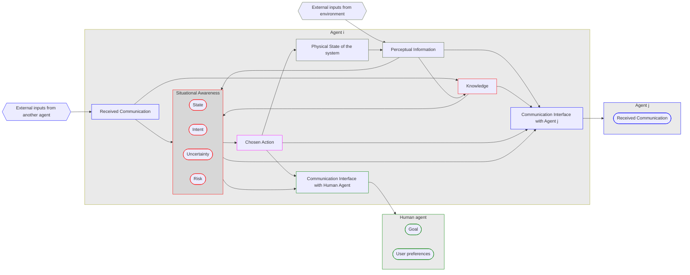
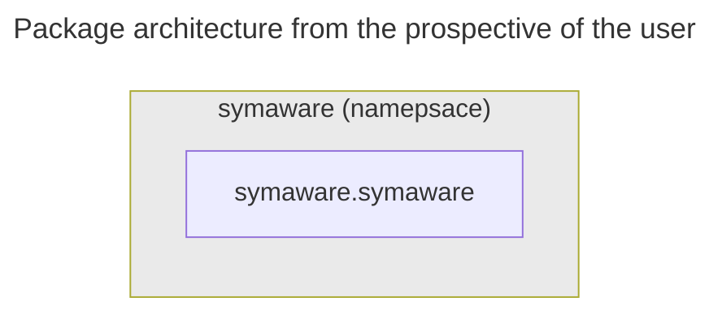
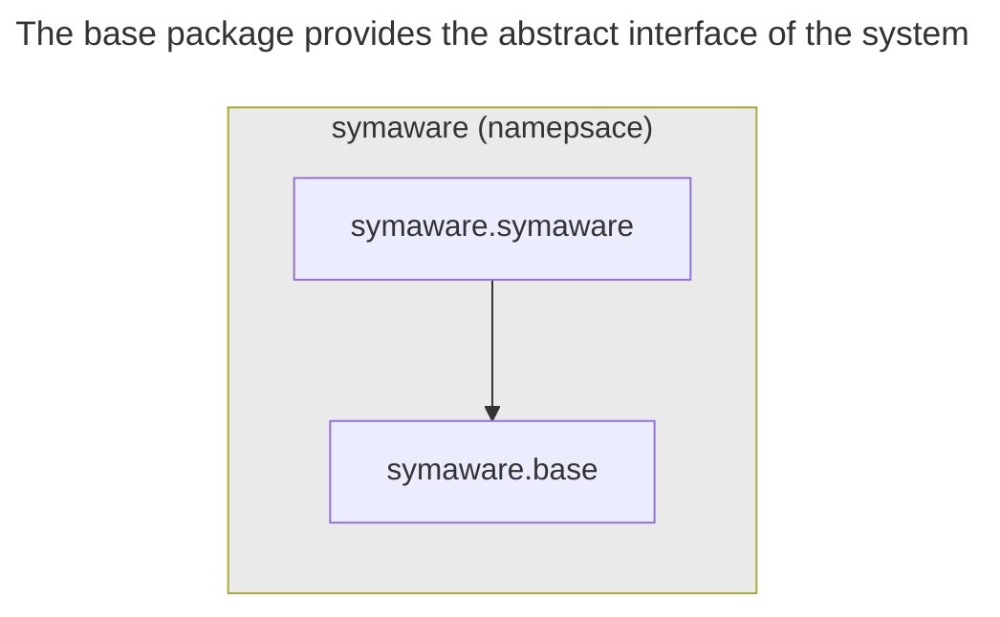
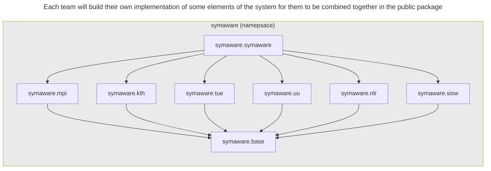
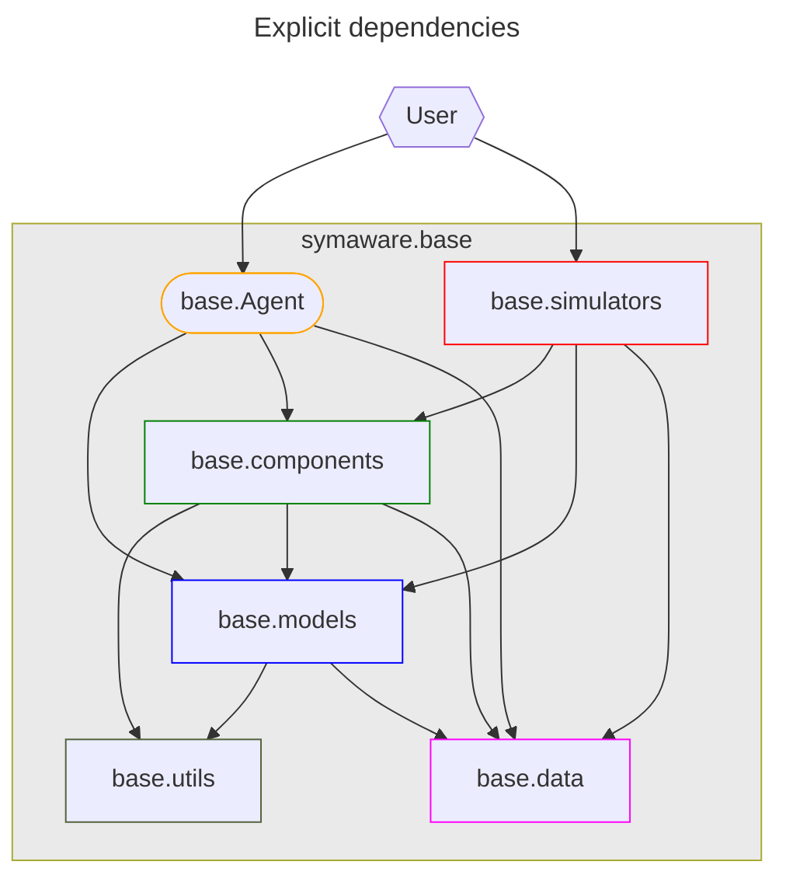
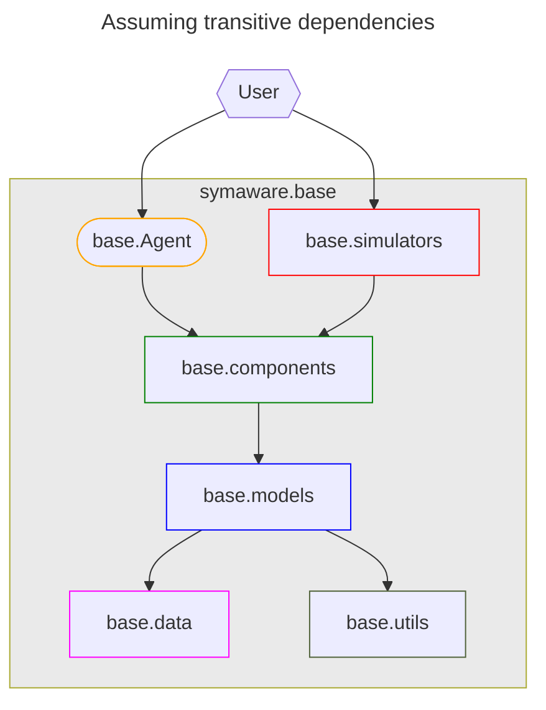
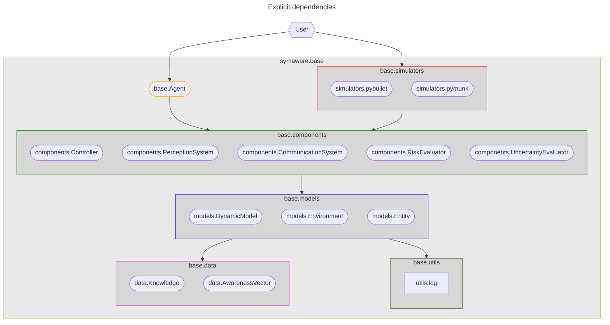
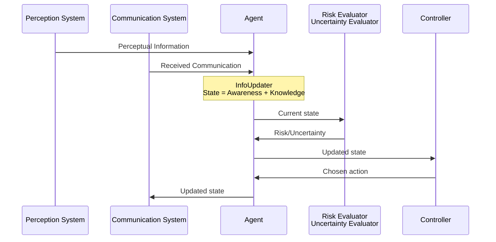

# Software design

## High level goal

The goal is to create a collection python packages an user can easily install on their machine.

The software must allow for different component implementations to be swapped easily.

<!-- .element: class="fragment" -->

<!-- New section -->

## Project structure



<!-- New section -->

## Package architecture

All packages will be namespaced under the `symaware` namespace.
From the `symaware.base` package, each team will then develop their own implementation of one or more elements of the system.



<!-- .element: class="fragment fade-in-then-out m-unset" -->



<!-- .element: class="fragment fade-in-then-out m-unset" -->



<!-- .element: class="fragment fade-in-then-out m-unset" -->

<!-- New section -->

### Software design of `symaware.base`

The main elements of the software have been divided in subpackages to enforce a coarse but clear separation of concerns.



<!-- .element: class="fragment fade-in-then-out m-unset" -->



<!-- .element: class="fragment fade-in-then-out m-unset" -->



<!-- .element: class="fragment fade-in-then-out m-unset" -->

<!-- New subsection -->

### Sequence diagram

The following sequence diagram shows the interaction between the different components of the system.



<!-- New section -->

## Asynchronous model

Instead of relying in a strict sequence of events, the system is designed to be asynchronous ([asyncio](https://docs.python.org/3/library/asyncio.html) is used for this purpose).

Each component is independent and can run concurrently with the others, with its own fire frequency or event trigger.

<!-- .element: class="fragment" -->

Most of the added complexity is hidden in the `symaware.base`.
Components can be developed only using standard, synchronous code.

<!-- .element: class="fragment" -->

<!-- New subsection -->

### AsyncLoopLock

The `AsyncLoopLock` class determines how often the component will run.

- `TimeIntervalAsyncLoopLock` runs the component at a fixed interval
- `EventAsyncLoopLock` runs the component when a specific event is triggered
- `DefaultAsyncLoopLock` the component will ruu continuously. Needs to be used in combination with a custom lock mechanism

<!-- .element: class="fragment" -->

See the [AsyncLoopLock documentation](https://sadegh.pages.mpi-sws.org/eicsymaware/api/symaware.base.utils.html#symaware.base.utils.async_loop_lock.AsyncLoopLock) or the [example](https://gitlab.mpi-sws.org/sadegh/eicsymaware/-/blob/base/examples/messages_lib.py) for more information.

<!-- .element: class="fragment" -->

<!-- New section -->

## Extending the system

The system is designed to be easily extensible.

There are two core aspects to this:

<!-- .element: class="fragment" data-fragment-index="1" -->

- **Adding new components**: components determine the behavior of the agent
- **Adding new models**: models simulate the environment and the physical state of the system

<!-- .element: class="fragment" data-fragment-index="1" -->

<!-- New subsection -->

### Adding new components

To add a new component, you must define a new class that inherits from the specific component they want to extend, which in turns inherits from `symaware.base.components.Component`.

The new component must implement its specific behavior in the abstract method the superclass provides.

<!-- .element: class="fragment" -->

For more information and examples, see the [Component documentation](https://sadegh.pages.mpi-sws.org/eicsymaware/api/symaware.base.components.html) or the [components subpackage](https://gitlab.mpi-sws.org/sadegh/eicsymaware/-/tree/base/src/symaware/base/components).

<!-- .element: class="fragment" -->

<!-- New subsection -->

#### Example: adding a new controller

```python
from symaware.base import Controller
class MyController(Controller):
    def __init__(self, agent_id, async_loop_lock = None):
        super().__init__(agent_id, async_loop_lock)
        self._control_input = np.zeros(0)

    def initialise_component(self, agent, initial_awareness_database, initial_knowledge_database):
        # Custom initialisation
        super().initialise_component(agent, initial_awareness_database, initial_knowledge_database)
        self._control_input = np.zeros(agent.model.control_input_shape)

    def _compute_control_input(self, awareness_database, knowledge_database):
        # Controller specific implementation
        return self._control_input, TimeSeries()
```

<!-- New subsection -->

#### Example: minimal controller

```python
from symaware.base import Controller

class MyController(Controller):

    def _compute_control_input(self, awareness_database, knowledge_database):
        # Controller specific implementation
        return np.zeros(self._agent.model.control_input_shape), TimeSeries()
```

<!-- New subsection -->

### Adding new models

Adding a new model is slightly more involved

It requires at least tree classes to be defined:

<!-- .element: class="fragment" data-fragment-index="1" -->

- `Environment`: the environment in which the agent operates
- `Entity`: the entities that populate the environment
- `DynamicModel`: the dynamic model of the entity

<!-- .element: class="fragment" data-fragment-index="1" -->

For more information and examples, see the [Model documentation](https://sadegh.pages.mpi-sws.org/eicsymaware/api/symaware.base.models.html) or the [simulators subpackage](https://gitlab.mpi-sws.org/sadegh/eicsymaware/-/blob/base/src/symaware/base/simulators).

<!-- .element: class="fragment" data-fragment-index="2" -->

<!-- New subsection -->

#### Example: adding a new environment

```python
from symaware.base import Environment
class PyBulletEnvironment(Environment):
    def __init__(self, async_loop_lock = None):
        super().__init__(async_loop_lock)
        self._initialise_pybullet()

    def _initialise_pybullet(self):
        p.connect(p.GUI)
        # ... more initialisation code

    def get_entity_state(self, entity: Entity) -> np.ndarray:
        return np.array(p.getBasePositionAndOrientation(entity.entity_id))

    def _add_entity(self, entity: Entity):
        entity.initialise()

    def step(self):
        for entity in self._agent_entities.values():
            entity.step()
        p.stepSimulation()
```

<!-- New subsection -->

#### Example: adding a new entity

```python
from symaware.base import Entity
@dataclass
class PybulletSphere(Entity):
    model: PybulletDynamicalModel = field(default_factory=NullDynamicalModel)
    pos: np.ndarray
    angle: np.array
    radius: float

    def initialise(self):
        col_id = p.createCollisionShape(p.GEOM_SPHERE, radius=self.radius)
        vis_id = p.createVisualShape(p.GEOM_SPHERE, radius=self.radius)
        entity_id = p.createMultiBody(1, col_id, vis_id, self.pos, self.angle)
        if not isinstance(self.model, NullDynamicalModel):
            self.model.initialise(entity_id)
```

<!-- New subsection -->

#### Example: adding a new dynamic model

```python
from symaware.base import DynamicModel
class PybulletRacecarModel(DynamicModel):
    def __init__(self, ID, max_force):
        super().__init__(ID, control_input=np.zeros(2), state=np.zeros(7))
    @property
    def subinputs_dict(self) -> PybulletRacecarModelSubinputs:
        return {"velocity": self.control_input[0], "angle": self.control_input[1]}

    def initialise(self, entity_id: int):
        self._entity_id = entity_id

    def step(self):
        target_velocity, steering_angle = self._control_input
        # Just steer the front wheels
        for steer in (0, 2):
            p.setJointMotorControl2(self._entity_id, steer, p.POSITION_CONTROL, targetPosition=steering_angle)
```

<!-- New section -->
